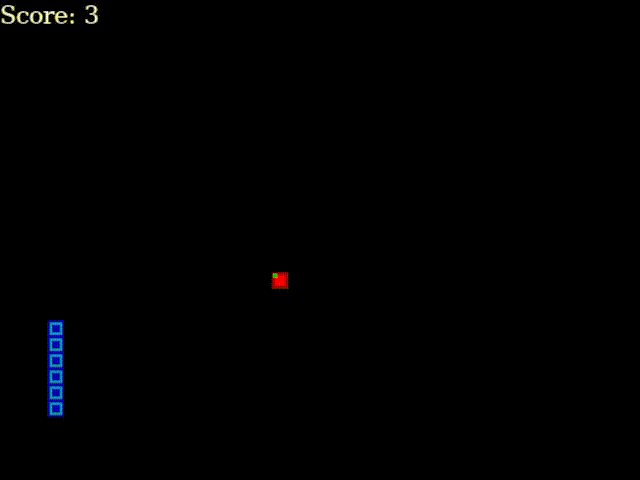
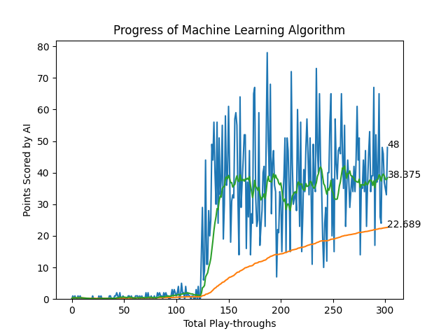

# SnakeAI
## The classic game of snake, but it is controlled by a Deep RL algorithm

### Objective
> This project has mainly been for learning about Deep Q Learning, Artificial Neural Networks, and Artificial Intelligence through practical exploration
- Teaching AI how to play a videogame, such as 'Snake', was a double edged sword for me. 
  - I get an efficient way to understand how AI algorithms work and learn
  - I get to better understand the science behind optimising results in a video game.
- More than just the AI aspect, I got to explore Python and working with larger projects as well as documenting my work

### Resources
> The entirety of this project is written in Python 3.9
#### I have created the game of Snake using the PyGame library, and implented the ANN using the PyTorch library.
- At the surface level, the code for the game is just a regular human-player snake game in python; however I've modified the code to handoff control to a second agent script instead
#### To quantify the AI learning and progressing, I have created a basic graph using the MatPlotLib and IPython libraries. These help me show all the previous runs alongside the one that is currently being played.
- In order to account for the randomness and fluctuations in score, I have added 2 additional data points to the graph alongside the scores.
  - Mean score 
  - Running average of last 16 runs, since mean is offset by failures in exploration stage.
#### The algorithm for the AI is based on Computational Darwinism, where a system of reward and punishment makes it so that the Reinforcement Learning based Neural Network creates a survival-of-the-fittest type of scenario.
- Due to this approach, no sample data of humans playing the game has to be input for the model
- The same lack of data also limits the capabilities of the AI

### Results

### Future updates
#### The algorithm is currently only learning for ~500 runs due to a hidden layer constraint and an error in the algorithm that causes the snake to loop and collide into itself. 
#### To solve that, I would need to form a map of all the blocks in the play-area and feed that as input layer states instead of the relative location of walls and apples. 
#### This method is more thorough and accurate but also resource intensive because of which I have not yet implemented it.
