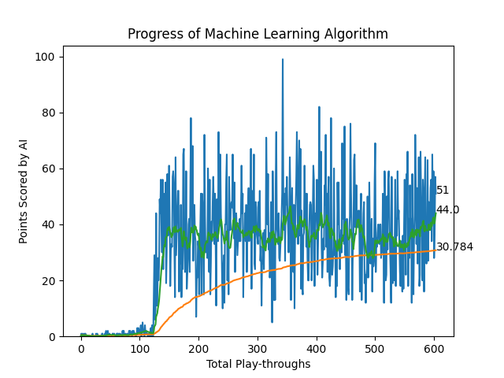

# SnakeAI
## The classic game of snake, but it is controlled by a Deep RL algorithm

### Objective
> This project has mainly been for learning about Deep Q Learning, Artificial Neural Networks, and Artificial Intelligence through practical exploration
- Teaching AI how to play a videogame, such as 'Snake', was a double edged sword for me. 
  - I get an efficient way to understand how AI algorithms work and learn
  - I get to better understand the science behind optimising results in a video game.
- More than just the AI aspect, I got to explore Python and working with larger projects as well as documenting my work

### Resources
> The entirety of this project is written in Python 3.9
##### I have created the game of Snake using the PyGame library, and implented the ANN using the PyTorch library.
- At the surface level, the code for the game is just a regular human-player snake game in python; however I've modified the code to handoff control to a second agent script instead
#### To quantify the AI learning and progressing, I have created a basic graph using the MatPlotLib and IPython libraries. These help me show all the previous runs alongside the one that is currently being played.
- In order to account for the randomness and fluctuations in score, I have added 2 additional data points to the graph alongside the scores.
  - Mean score 
  - Running average of last 16 runs, since mean is offset by failures in exploration stage.
#### The algorithm for the AI is based on Computational Darwinism, where a system of reward and punishment makes it so that the Reinforcement Learning based Neural Network creates a survival-of-the-fittest type of scenario.
- Due to this approach, no sample data of humans playing the game has to be input for the model
- The same lack of data also limits the capabilities of the AI

### Results
> Updated results might be attached at the end

#### As you can see in the image, the AI takes a 128 run exploration period to completely understand the mechanics of the game and its objective.
#### Once the AI has learnt how to move efficiently and that it needs to eat apples and avoid hitting itself, it starts using the mutations of the Neural Network to maximise its Q value (and subsequently the score)

#### However, as the second graph has shown the AI's improvements have a limit and the mutations stop giving any tangible improvements to the score after a few hundred runs.
#### The reason for the plateauing of score is likely the algorithm written not being advanced enough to go any further.
#### One of the biggest issues the AI encounters is looping and moving in a fixed circle forever instead of getting bigger after a certain point. This has been counteracted somewhat with a time runout penalty but there might be more sophisticated fixes to be found

### Potential Future updates
> I am probably currently working on implementing these, but would still appreciate any input on a good way to do it
#### The algorithm is currently only learning for ~500 runs due to a hidden layer constraint and an error in the algorithm that causes the snake to loop and collide into itself. 
#### To solve that, I would need to form a map of all the blocks in the play-area and feed that as input layer states instead of the relative location of walls and apples. 
#### This method is more thorough and accurate but also resource intensive because of which I have not yet implemented it.

## How to run the AI Model
Step 1: Download [Python 3.9](https://www.python.org/downloads/release/python-3916/) and make sure it is installed and configured properly
Step 2: Open a Terminal (Command Prompt/Windows Powershell) and type in the following command:
- pip install torch torchvision ipython matplotlib pygame numpy
Step 3: Download the code from the GitHub repository
Step 4: Right click in the File Explorer window with the code open and select open Terminal here
Step 5: Type and enter the following command:
- python agent.py
